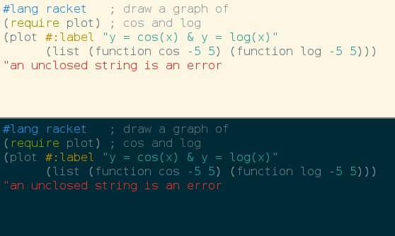

Solarized Colorscheme for DrRacket
==================================

This package adds a Solarized colorscheme to DrRacket, the IDE
of the [Racket programming language](http://www.racket-lang.org).

See the [Solarized homepage](http://ethanschoonover.com/solarized) for
screenshots, details and colorscheme versions for Vim, Mutt, popular terminal
emulators and other applications.

Note: colorschemes are only supported on [Racket 6.0](http://download.racket-lang.org/racket-v6.0.html)
and newer versions.

Installation
------------

From the package catalog:

  * `raco pkg install drracket-solarized`

Directly from github:

  * `raco pkg install git://github.com/takikawa/drracket-solarized`

License
-------

Distributed under the MIT license. See the COPYING file.

